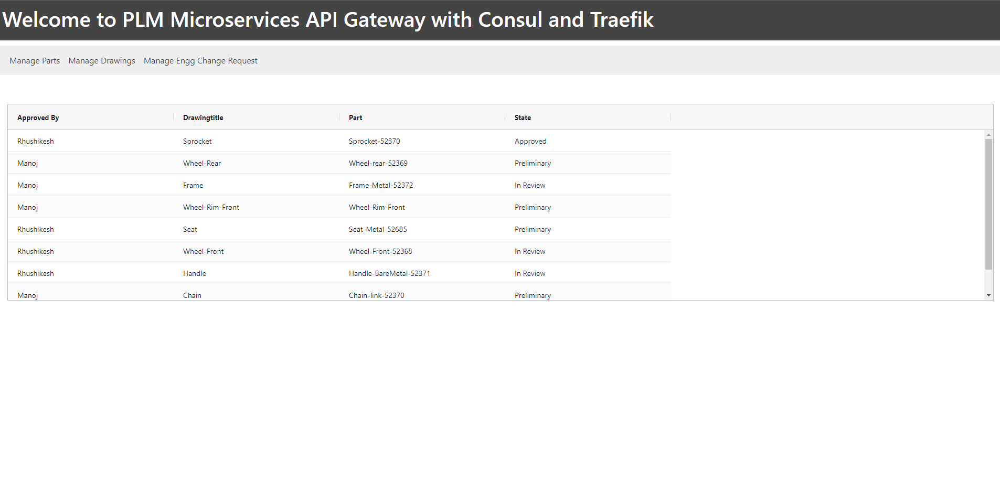
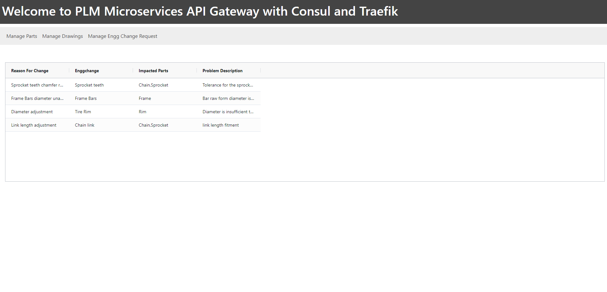
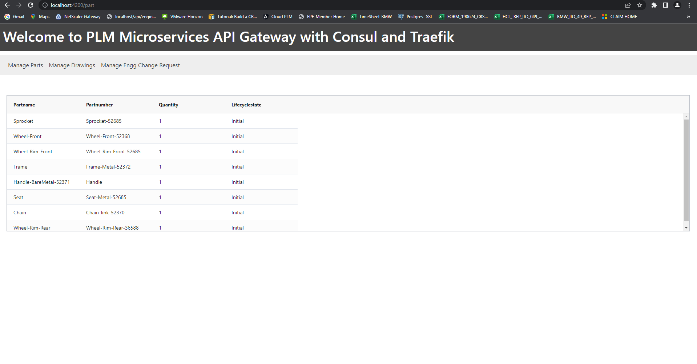

# PLM Microservices API Gateway with Traefik and Consul  

# Start the config server

## mvn clean install

## java -jar target/plm-config-server-2.3.1.jar

# Start the zipkin tracing (download zipkin)

## java -jar zipkin/zipkin.jar

# Start the consul in dev mode

## consul agent -dev

# Start the productstructure microservice

## mvn clean install

## java -jar target/plm-productstructure-service-2.3.1.jar

# Start the engineering microservice

## mvn clean install

## java -jar target/plm-engineering-service-2.3.1.jar 

# Start the ipec microservice

## mvn clean install

## java -jar target/plm-ipec-service-2.3.1.jar

# Consul import the configuration for routing microservices

## consul kv import "$(cat config.json)"

# Start the Traefik agent

## traefik

## Consul
http://localhost:8500

## Traefik
http://localhost:8080

## health
http://localhost/api/engineering/actuator/health

# API Gateway for PLM Microservices

## Manage Drawings

## Manage Engineering Change Requests

## Manage Parts

